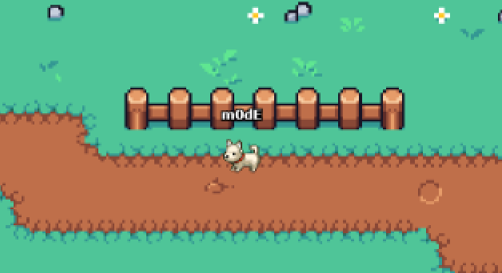

<div align="center">
  <a href="https://modd.io">
    
  </a>
</div>

<div align="center">
  <h2>HTML5 Game Engine</h2>
  <p>Taro is a multiplayer game engine. It can support up to 64 concurrent players hosted on a $5 / month VM while running Box2D physics. Join us on <a href="https://discord.gg/XRe8T7K">Discord</a> or support us on <a href="https://www.patreon.com/moddio">Patreon</a>.
</div>

<div align="center">
  
  
  
</div>


<div align="center">
  <h3>Demo</h3>
  <a href="http://taro.town"></a>
</div>
<br>

## What's included in the box
- Box2D Physics
- Netcode using UWS and LZ-string compression
- Inventory & item system
- Unit attributes (HP, Energy, etc)
- Weapon system (melee & projectile)
- Dialogues
- Shops
- Unit control (top-down WASD or platformer)
- Client-side predicted projectile + unit movement (optional)
- Basic AI
- Mobile controls
- and more!

## Node Version
Node Versions below [14](https://nodejs.org) are not supported due to package incompatibility and degraded performance.

## Running a game server
Taro engine will run games made using [modd.io](https://www.modd.io).

To run the game server, execute the following command:
```
npm run server --game=<gameID>
```
*if the gameID argument is not provided, then the engine will use game.json stored in root directory instead.

Your game's Game ID can be found in your modd.io's game's sandbox ([example](https://beta.modd.io/sandbox/game/two-houses/scripts)). Go to menu -> about.


## Quick start example - Run "Two Houses" locally

Install [Node 14](https://nodejs.org) or later and then...

```
git clone https://github.com/moddio/taro.git
cd taro
npm install
npm run server --game=5a7fd59b1014dc000eeec3dd
```

## Connecting to the game server
Visit http://localhost:2000 to start testing game.

## How to customize game client UI
Game client's user interface is rendered by [/src/index.ejs](https://github.com/moddio/taro/blob/master/src/index.ejs) file and the theme files in [/src/templates/](https://github.com/moddio/taro/tree/master/src/templates)

## How to make games on modd.io
Please visit https://www.modd.io/tutorials for more information

## We need contributors, and we are also hiring
Performance optimization is a hard problem that takes aeons to solve. We are always looking for more developers to help us. To be a contributor, please contact m0dE in our [Discord](https://discord.gg/XRe8T7K) If you find yourself enjoying working with us, then we should seriously consider working together.

Taro is completely free and open source under the MIT license.

Taro Engine was originally forked from [Isogenic Game Engine](https://www.isogenicengine.com/) back in 2016.
